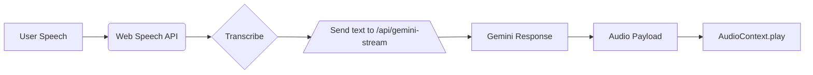

# Gemini API Integration

This submodule enables real-time multimodal interactions with Google's GenAI Live API, supporting text, audio, and video modalities through streaming SSE endpoints.

## Key Capabilities

### 1. Multimodal Streaming

- **Text+Audio Streaming**: Simultaneous text transcriptions and audio responses
- **Video Frame Processing**: Analyze video frames via base64-encoded image data
- **Screen Content Analysis**: Process screenshots/screencasts using `mimeType: image/jpeg`

### 2. Voice-to-Voice Interaction



- Capture user speech with browser's `SpeechRecognition`
- Send transcribed text to SSE endpoint
- Handle audio responses in the client

```ts
// Play Gemini audio response
const audio = new Audio(`data:audio/wav;base64,${audioPayload}`);
audio.play();
```

---

### 3. Screen Access & Analysis

- Client-side capture: Use `getDisplayMedia()` for screen sharing
- Send frames: POST screenshots as base64 with `mimeType: image/jpeg`

**Example analysis prompts:**
- "Analyze this UI: What's the main call to action?"
- "Identify errors in this console output"
- "Summarize the content in this documentation screenshot"

---

## Usage

### Basic SSE Consumption

```tsx
// React component example
import { useGeminiStream } from '@/hooks/useGeminiStream';
import { useEffect } from 'react';

function VoiceChat() {
  const { start, stop, events } = useGeminiStream({
    input: 'Hello! How can I help?',
    method: 'POST'
  });

  // Handle audio responses
  useEffect(() => {
    const audioEvent = events.find(
      e => e.type === 'message' && e.payload?.audio
    );
    if (audioEvent) {
      const audio = new Audio(`data:audio/wav;base64,${audioEvent.payload.audio}`);
      audio.play();
    }
  }, [events]);
}
```

---

### Screen Analysis Request

```js
// Capture and send screenshot
const stream = await navigator.mediaDevices.getDisplayMedia({ video: true });
// You need to implement captureVideoFrame to extract a frame as an image
const frame = await captureVideoFrame(stream); 

fetch('/api/gemini-stream', {
  method: 'POST',
  headers: { 'Content-Type': 'application/json' },
  body: JSON.stringify({ 
    input: 'Analyze this UI',
    assets: [{
      mimeType: 'image/jpeg',
      data: frame.toDataURL('image/jpeg')
    }]
  })
});
```

---

## Configuration

Set these environment variables:

```env
# Gemini Developer API
GOOGLE_API_KEY=your_api_key

# OR Vertex AI
GOOGLE_GENAI_USE_VERTEXAI=true
GOOGLE_CLOUD_PROJECT=your_project
GOOGLE_CLOUD_LOCATION=us-central1

# CORS (optional)
CORS_ALLOW_ORIGINS="https://your-app.com,http://localhost:3000"
CORS_ALLOW_CREDENTIALS=true
```

---

## Advanced Features

- **Conversational Memory**: Auto-appends chat history to subsequent requests
- **Interruptions**: Handle `abort.signal` for real-time interruption
- **Emotion Detection**: Analyze voice tone via audio waveform metadata
- **Accessibility**: Screen reader support through ARIA-compliant responses

---

## Troubleshooting

| Error                | Solution                                      |
|----------------------|-----------------------------------------------|
| Missing API key      | Set `GOOGLE_API_KEY` in `.env.local`          |
| CORS blocked         | Verify `CORS_ALLOW_ORIGINS` matches your domain |
| No audio output      | Check browser autoplay policies and permissions|
| Slow responses       | Use `gemini-2.5-flash` model for faster inference |

---

## Ethical Guidelines

- Always obtain user consent before accessing screen/camera
- Anonymize sensitive data in screenshots
- Provide opt-out for voice recording
- Comply with GDPR/CCPA for data processing

> **Note:** Screen access requires HTTPS and user permission. Actual implementation depends on client-side integration.